# React Component Library

A small UI component library built with **React (Next.js)**, **TypeScript**, and **Storybook**.  
It includes custom **Input**, **Toast notification**, and **Sidebar Menu** components with different states and behaviors.

---

## 📦 Table of Contents

1. [Getting Started](#getting-started)
2. [Available Scripts](#available-scripts)
3. [Project Structure](#project-structure)
4. [Components](#components)
   - Input
   - Toast
   - Sidebar Menu
5. [Screenshots](#screenshots)
6. [How to Use in Your Project](#how-to-use-in-your-project)
7. [Development](#development)

---

## 🚀 Getting Started

To run the component library locally and preview components in Storybook:

```bash
npm install
npm run storybook

```

## 🛠️ Available Scripts

npm run storybook: Runs the Storybook server locally. <br/>
npm run build: Builds the project for production.

## 📁 Project Structure

Here’s an example of the folder structure for the component library:

```bash
project-root/
├── .storybook/
├── public/
├── src/
│ ├── components/
│ │ ├── Input/
│ │ ├── Toast/
│ │ └── SidebarMenu/
│ ├── stories/
│ └── types/
├── package.json
├── tsconfig.json
└── README.md

```

src/components — contains UI components, CSS modules, types, and stories
hooks — any custom React hooks (e.g. a toast hook)
utils — helper functions
public — static files served by Storybook via staticDirs

## ✨ Components

Here are the main components provided in this library:
<br/>

Input:

- Supports types: text, password, number
- Password visibility toggle (eye icon)
- Clearable input via clearable prop
- Can be controlled or uncontrolled

Toast:

- Types: success, error, info, warning
- Auto-dismiss after a configurable duration
- Fade / slide animation
- Optional manual close button

Sidebar Menu:

- Slides in/out from the right
- Supports nested submenus
- Closes when clicking the backdrop

## 📸 Screenshots

Here are example screenshots of the components in different states:
<br/>

### Input

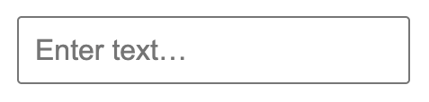

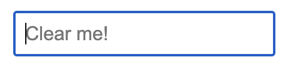

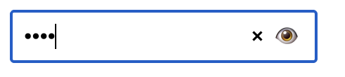

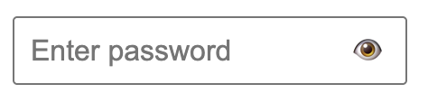

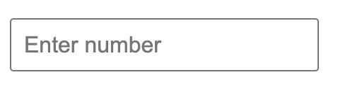

### Toast

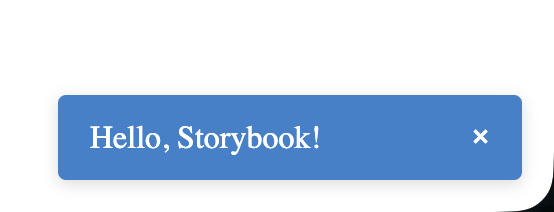

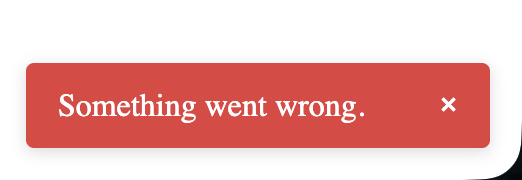

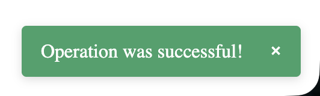

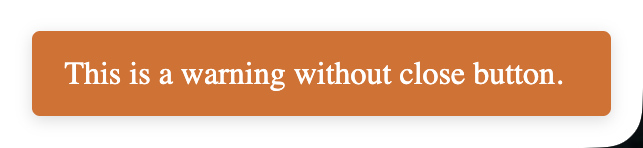

### Sidebar Menu

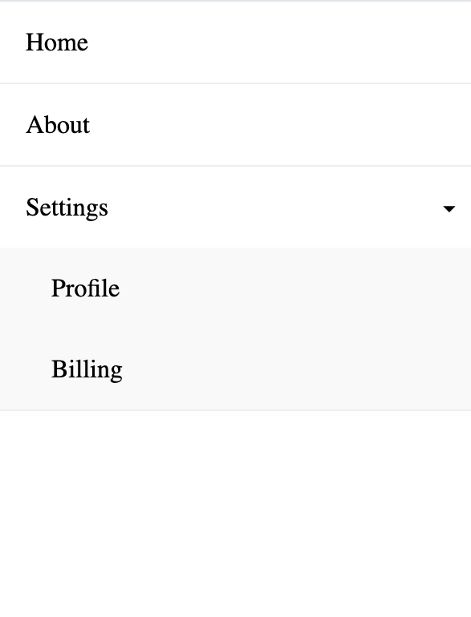

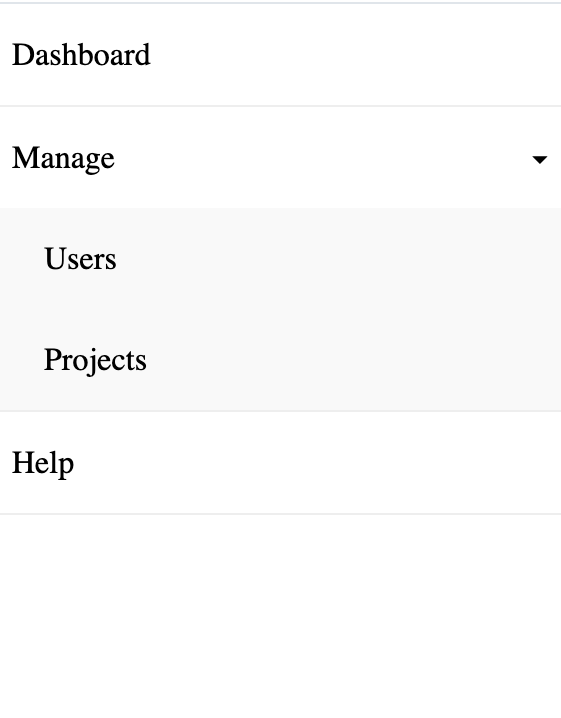

## 💡 How to Use in Your Project

You can import and use the components like this:

```bash
import { Input, Toast, SidebarMenu } from "your-component-library";

function App() {
return (

<div>
<Input type="text" placeholder="Type here..." clearable />

      {/* Example toast usage (if you use a hook) */}
      {/* const { showToast } = useToast(); */}
      {/* showToast({ message: "Hello!", type: "success", duration: 3000 }); */}

      {/* Example sidebar menu usage */}
      {/* <SidebarMenu isOpen={isOpen} onClose={() => setIsOpen(false)} items={menuItems} /> */}
    </div>

);
}
```

## 👩‍💻 Development

If you want to contribute:
Fork this repository
Create a branch for your feature or bug fix
Make changes and add or update stories (.stories.tsx)
Run Storybook to verify (npm run storybook)
Submit a pull request
